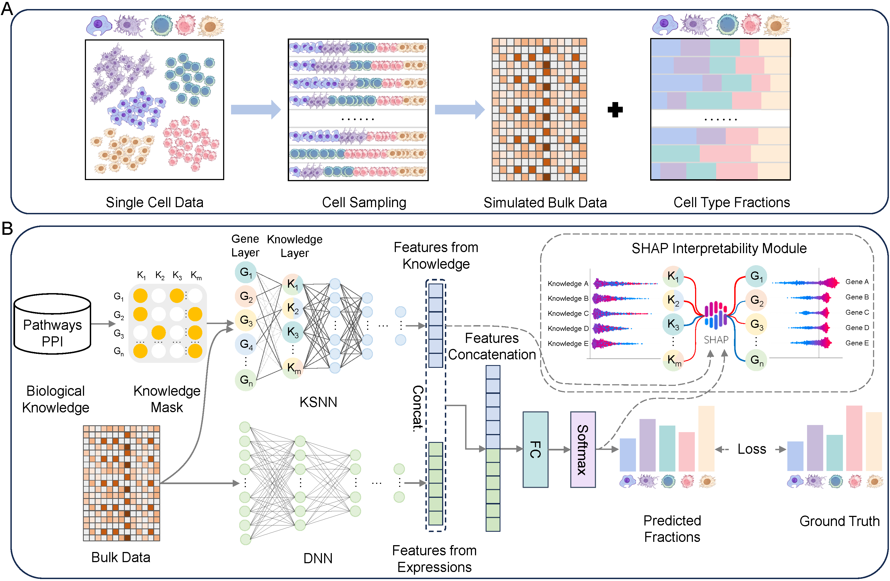

# BIND: A Biologically-informed Neural Network for Interpretable Deconvolution of Cell Fractions

**BIND** is a deep learning framework designed for accurate and interpretable deconvolution of cell type fractions from bulk tissue gene expression data. By integrating prior biological knowledge, such as protein-protein interaction (PPI) networks and biological pathways, BIND not only achieves state-of-the-art performance but also provides insights into the cell-type-specific molecular mechanisms through its built-in interpretability module.

This repository contains the source code for the BIND paper.

*The BIND framework workflow.
(A) Pseudo-bulk data generation. Pseudo-bulk samples with known cell-type proportions are generated by computationally sampling cells from scRNA-seq datasets. These samples serve as the model input and ground truth for training.
(B) The dual-stream architecture of BIND. The model processes expression data through two parallel streams. A DNN stream learns data-driven features, while a KSNN stream, structured by a mask derived from biological knowledge (e.g., pathways, PPIs), extracts knowledge-guided features. These feature vectors are concatenated, fused by a fully connected (FC) layer, and passed to a softmax layer for final fraction prediction. An integrated SHAP module provides interpretation of gene and knowledge contributions.*

## Installation Guide

### Prerequisites

- Python 3.8+
- PyTorch
- CUDA

### Steps

1. **Clone the repository:**

   ```
   git clone [https://github.com/gstaryu/BIND.git](https://github.com/gstaryu/BIND.git)
   cd BIND
   ```

2. Install dependencies:

   It is recommended to use a virtual environment (e.g., conda or venv).

   ```
   pip install -r requirements.txt
   ```

## Quick Start

### 1. Prepare Data

Place your data files in the `data/` directory. Required files include:

- **Single-cell reference data**: An H5AD/TXT file containing single-cell expression profiles and cell labels.
- **Bulk expression data**: A CSV/TXT file with genes as rows and samples as columns (e.g., `data/Real bulk/GSE107572.txt`).
- **Knowledge files**:
  - PPI Network: A text file representing protein-protein interactions (e.g., `data/knowledge/PPI_data_min700.txt`).
  - Biological Pathways: Gene set files in GMT format (e.g., `data/knowledge/c2.cp.reactome.v2024.1.Hs.symbols.gmt`).

### 2. Simulate Pseudo-bulk Data from Single-cell Reference

Run the `simulation.py` script to generate pseudo-bulk data from single-cell reference data for subsequent training.

```
simulation(
        sc_data: Union[str, pd.DataFrame, anndata.AnnData],
        out_name: Optional[str] = None,
        total_cells_per_sample: int = 500,
        num_samples: int = 8000,
        distribution_function: str = 'dirichlet',
        sparse: bool = True,
        sparse_prob: float = 0.5,
        cell_count_variation: bool = True,
        cell_count_variation_range: Tuple[float, float] = (0.8, 1.2),
        add_noise: bool = False
)
```

**Parameters:**

```
sc_data: Single-cell data, can be a file path (str), pandas DataFrame, or anndata.AnnData object. For a DataFrame, the index should be cell types. For an AnnData object, cell types should be in `adata.obs['CellType']`.
out_name: Output filename (without extension). If provided, the data will be saved as an .h5ad file.
total_cells_per_sample: Total number of cells in each simulated sample.
num_samples: Number of simulated samples to generate.
distribution_function: Distribution function to generate cell proportions ('dirichlet' or 'uniform').
sparse: Whether to make the cell composition of some samples sparse.
sparse_prob: If sparse=True, this controls the degree of sparsity and the proportion of affected samples.
cell_count_variation: Whether to introduce Poisson-distributed variation in cell counts.
cell_count_variation_range: If cell_count_variation=True, the range for cell count fluctuation.
add_noise: Whether to add Gaussian noise to the final pseudo-bulk data.
```

### 3. Train BIND and Perform Deconvolution

Run the `main.py` script to train the model and get deconvolution results. You can start with the provided simulated or real data.

**Example command:**

```
main(data_name, run_epochs, is_knowledge)
```

**Parameters:**

```
data_name: The name of the dataset to be tested, e.g., 'GSE107572'.
run_epochs: The number of rounds to run training and testing, defaults to 3. The final result is the average of the three runs.
is_knowledge: Whether to incorporate prior biological knowledge into the model, defaults to True.
```

If you want to use your own simulated or real data, you can change `load_data` in main.py to `load_data_from_path(train_path, test_path, variance_threshold=0.99)`, which can directly read data from file paths.

### 4. Interpret the Model with SHAP

If you want to get interpretability results while performing deconvolution, you can use the `main_interpretability.py` script, which includes all the functionalities of `main.py` and adds interpretability features.

**Example command:**

```
main(data_name, run_epochs, is_knowledge, interpretability)
```

**Parameters:**

```
data_name: The name of the dataset to be tested, e.g., 'GSE107572'.
run_epochs: The number of rounds to run training and testing, defaults to 3. The final result is the average of the runs.
is_knowledge: Whether to incorporate prior biological knowledge into the model, defaults to True.
interpretability: Whether to perform interpretability analysis, defaults to True. The results depend on the last run epoch.
```

The analysis results can be visualized and further explored using the Jupyter notebooks in the `plot/` directory (e.g., `plot/SHAP.ipynb`, `plot/Enrichment Analysis.ipynb`).

## Directory Structure

```
.
├── BIND/                     # Source code for the BIND model, training, and utilities
│   ├── __init__.py
│   ├── model.py              # BIND model architecture
│   ├── simulation.py         # Pseudo-bulk data simulation script
│   ├── train.py              # Training and testing loop script
│   ├── shap_utils.py         # SHAP interpretability analysis tools
│   └── utils.py              # Utility functions for data loading, preprocessing, etc.
│
├── data/                     # Datasets and knowledge bases
│   ├── knowledge/            # Prior biological knowledge
│   └── Real bulk/            # Real-world bulk tissue expression data
│
├── plot/                     # Jupyter notebooks for result visualization and analysis
│   ├── Ablation.ipynb        # Ablation study results visualization
│   ├── clinical.ipynb        # Clinical analysis related visualizations
│   ├── Enrichment Analysis.ipynb # Enrichment analysis visualization
│   ├── result_display.ipynb  # Main results display
│   └── SHAP.ipynb            # SHAP results visualization
│
├── results/                  # Default output directory for models and results
│
├── main.py                   # Main script for model training and deconvolution
├── main_interpretability.py  # Script for model interpretability analysis (SHAP)
└── README.md                 # This file
```

## Citation

If you use BIND in your research, please cite our paper:

```
[Citation information will be added here once the paper is published]
```

## License

This project is licensed under the MIT License. See the `LICENSE` file for details.